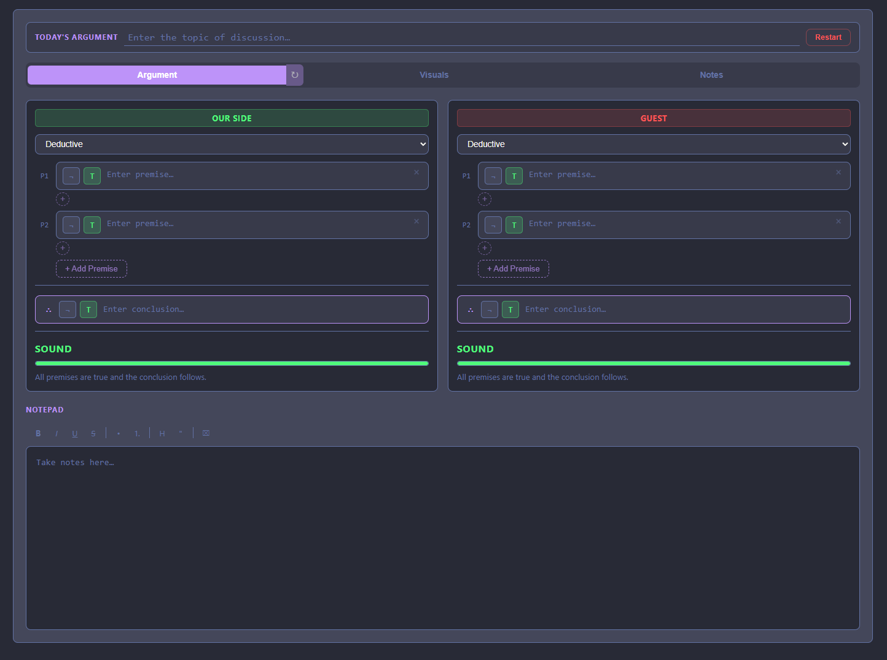
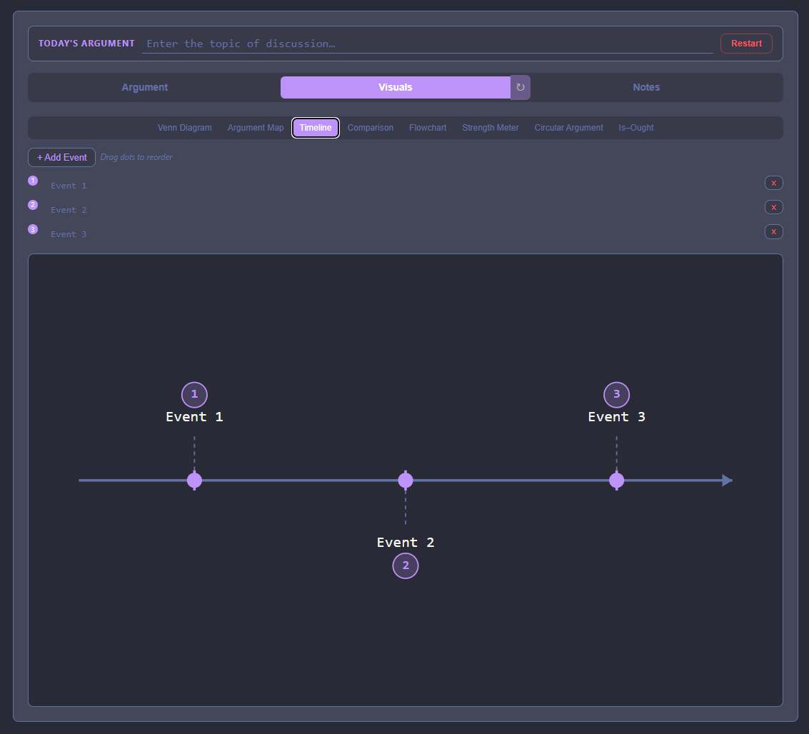
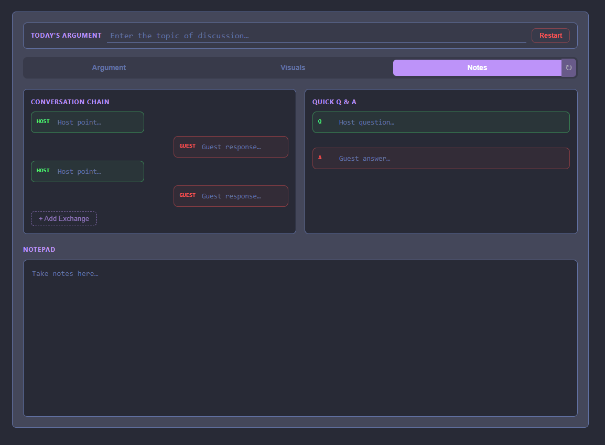

# Argument Visualizer

A real-time graphical argument mapping tool for debate hosts. Replace ad-hoc Notepad tracking with a structured, visual interface that audiences can follow. Enter premises and conclusions live — get instant validity feedback.

## Features

- **Dual-panel argument boards** — Our Side vs Guest, side by side
- **Argument types** — Deductive, Inductive, Abductive, Analogical with type-appropriate verdict language
- **Per-premise controls** — Negation toggle, truth-value toggle, add/remove premises
- **Live validity bar** — Color-coded feedback (green/yellow/red) with real-time evaluation
- **Visual tools** — Venn diagrams, argument maps, timelines, comparison tables, flowcharts, strength meters, circular argument detector, Is-Ought analysis
- **Notes tab** — Conversation chain tracker, quick Q&A, and a freeform notepad
- **Light / Dark mode**







## Resetting the Board

There are three levels of reset:

- **Tab refresh** (circular arrow on each tab) — Clears only the fields on that tab. For example, refreshing the Argument tab resets premises, conclusion, and the notepad, but leaves Visuals and Notes untouched.
- **Restart button** (on-screen) — Resets everything except the topic/title field, so you can start a new argument under the same topic.
- **Full browser refresh** (F5 / Ctrl+R) — Completely resets the entire app back to its default state.

## Prerequisites

- [Node.js](https://nodejs.org/) (v18 or higher recommended)
- npm (comes with Node.js)

## Setup

### Windows

1. Install Node.js from [https://nodejs.org](https://nodejs.org) (LTS version)
2. Open Command Prompt or PowerShell
3. Clone the repo and install:

```bash
git clone https://github.com/trotnazty/argument-visualizer.git
cd argument-visualizer
npm install
```

4. Start the dev server:

```bash
npm run dev
```

5. Open [http://localhost:5173](http://localhost:5173) in your browser

### Linux

1. Install Node.js (if not already installed):

```bash
# Ubuntu/Debian
sudo apt update && sudo apt install -y nodejs npm

# Or use nvm (recommended)
curl -o- https://raw.githubusercontent.com/nvm-sh/nvm/v0.39.7/install.sh | bash
nvm install 18
```

2. Clone and install:

```bash
git clone https://github.com/trotnazty/argument-visualizer.git
cd argument-visualizer
npm install
```

3. Start the dev server:

```bash
npm run dev
```

4. Open [http://localhost:5173](http://localhost:5173) in your browser

## Commands

| Command | Description |
|---------|-------------|
| `npm install` | Install dependencies |
| `npm run dev` | Start Vite dev server |
| `npm run build` | Production build to `dist/` |
| `npm run preview` | Preview production build |

## Tech Stack

Vanilla JavaScript + [Vite](https://vitejs.dev/). No frameworks.

## License

MIT
